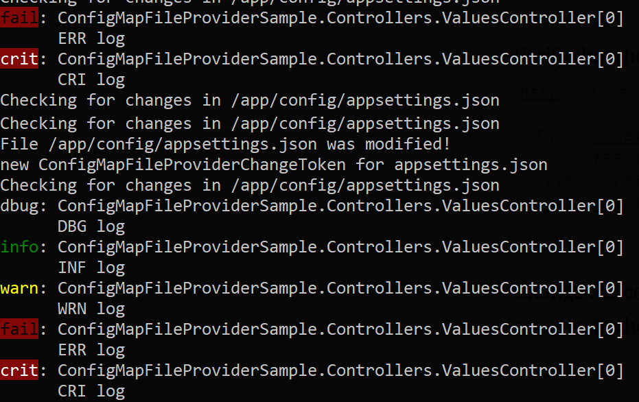

# .NET Configuration in Kubernetes config maps with auto reload



Kubernetes config maps allows the injection of configuration into an application. The contents of a config map can be injected as environment variables or mounted files.

For instance, imagine you want to configure the log level in a separated file that will be mounted into your application.

The following config map limits the verbosity to errors: 

```yaml
apiVersion: v1
kind: ConfigMap
metadata:
  name: demo-config
data:
  appsettings.json: |-
    {
      "Logging": {
        "LogLevel": {
          "Default": "Error",
          "System": "Error",
          "Microsoft": "Error"
        }
      }
    }
```

The file below deploys an application, mounting the contents of the config map into the /app/config folder.

```yaml
apiVersion: apps/v1
kind: Deployment
metadata:
  name: demo-deployment
  labels:
    app: config-demo-app
spec:
  replicas: 1
  selector:
    matchLabels:
      app: config-demo-app
  template:
    metadata:
      labels:
        app: config-demo-app
    spec:
      containers:
      - name: configmapfileprovidersample
        image: fbeltrao/configmapfileprovidersample:1.0
        ports:
        - containerPort: 80
        volumeMounts:
        - name: config-volume
          mountPath: /app/config
      volumes:
      - name: config-volume
        configMap:
          name: demo-config
```

In order to read configurations from the provided path (`config/appsettings.json`) the following code changes are required:

```c#
public static IWebHostBuilder CreateWebHostBuilder(string[] args) =>
    WebHost.CreateDefaultBuilder(args)
        .ConfigureAppConfiguration(c =>
        {
           c.AddJsonFile("config/appsettings.json", optional: true, reloadOnChange: true);
        })
        .UseStartup<Startup>();
```


Deploy the application:
```bash
kubectl apply -f configmap.yaml
kubectl apply -f deployment.yaml
```

We can peek into the running pod in Kubernetes, looking at the files stored in the container:

```bash
kubectl exec -it <pod-name> -- bash
root@demo-deployment-844f6c6546-x786b:/app# cd config/
root@demo-deployment-844f6c6546-x786b:/app/config# ls -la

rwxrwxrwx 3 root root 4096 Sep 14 09:01 .
drwxr-xr-x 1 root root 4096 Sep 14 08:47 ..
drwxr-xr-x 2 root root 4096 Sep 14 09:01 ..2019_09_14_09_01_16.386067924
lrwxrwxrwx 1 root root   31 Sep 14 09:01 ..data -> ..2019_09_14_09_01_16.386067924
lrwxrwxrwx 1 root root   53 Sep 14 08:47 appsettings.json -> ..data/appsettings.json
```

As you can see, the config map content is mounted using a [symlink](https://en.wikipedia.org/wiki/Symbolic_link). 

Let's change the log verbosity to `debug`, making the following changes to the config map:

```yaml
apiVersion: v1
kind: ConfigMap
metadata:
  name: demo-config
data:
  appsettings.json: |-
    {
      "Logging": {
        "LogLevel": {
          "Default": "Debug",
          "System": "Error",
          "Microsoft": "Error"
        }
      }
    }
```
and redeploying it

```bash
kubectl apply -f configmap.yaml
```

Eventually the changes will be applied to the mounted file inside the container, as you can see below:

```bash
root@demo-deployment-844f6c6546-gzc6j:/app/config# ls -la
total 12
drwxrwxrwx 3 root root 4096 Sep 14 09:05 .
drwxr-xr-x 1 root root 4096 Sep 14 08:47 ..
drwxr-xr-x 2 root root 4096 Sep 14 09:05 ..2019_09_14_09_05_02.797339427
lrwxrwxrwx 1 root root   31 Sep 14 09:05 ..data -> ..2019_09_14_09_05_02.797339427
lrwxrwxrwx 1 root root   53 Sep 14 08:47 appsettings.json -> ..data/appsettings.json
```

Notice that the appsettings.json last modified date does not change, only the referenced file actually gets updated.

Unfortunately, the build-in reload on changes in .NET core file provider does not work. The config map does not trigger the configuration reload as one would expect.

Based on my investigation, it seems that the .NET core change discovery relies on the file last modified date. Since the file we are monitoring did not change (the symlink reference did), no changes are detected.

## Working on a solution

This problem is tracked [here](https://github.com/aspnet/Extensions/issues/1175). Until a fix is available we can take advantage of the extensible configuration system in .NET Core and implement a file based configuration provider that detect changes based on file contents.

The setup looks like this:
```c#
public static IWebHostBuilder CreateWebHostBuilder(string[] args) =>
    WebHost.CreateDefaultBuilder(args)
        .ConfigureAppConfiguration(c =>
        {
            c.AddJsonFile(ConfigMapFileProvider.FromRelativePath("config"), 
                "appsettings.json", 
                optional: true, 
                reloadOnChange: true);
        })
        .UseStartup<Startup>();
```

The provided implementation detect changes based on the hash of the content. Check the sample project files for more details.

Disclaimer: this is a quick implementation, not tested in different environments/configurations. Use at your own risk.

### Testing the sample application

Clone this repository then deploy the application:
```bash
kubectl apply -f configmap.yaml
kubectl apply -f deployment.yaml
```

In a separated console window stream the container log:
```bash
kubectl logs -l app=config-demo-app -f
```

Open a tunnel to the application with kubectl port-forward
```bash
 kubectl port-forward <pod-name> 60000:80
```

Verify that the log is in error level, by opening a browser and navigating to `http://localhost:60000/api/values`. Look at the pod logs. You should see the following lines:
```log
fail: ConfigMapFileProviderSample.Controllers.ValuesController[0]
      ERR log
crit: ConfigMapFileProviderSample.Controllers.ValuesController[0]
      CRI log
```

Change the config map:
Replace `"Default": "Error"` to `"Default": "Debug"` in the configmap.yaml file, then redeploy the config map.
```bash
kubectl apply -f configmap.yaml
```

Verify that the log level changes to Debug (it can take a couple of minutes until the file change is detected) by issuing new requests to `http://localhost:60000/api/values`. The logs will change to this:
```log
dbug: ConfigMapFileProviderSample.Controllers.ValuesController[0]
      DBG log
info: ConfigMapFileProviderSample.Controllers.ValuesController[0]
      INF log
warn: ConfigMapFileProviderSample.Controllers.ValuesController[0]
      WRN log
fail: ConfigMapFileProviderSample.Controllers.ValuesController[0]
      ERR log
crit: ConfigMapFileProviderSample.Controllers.ValuesController[0]
      CRI log
```